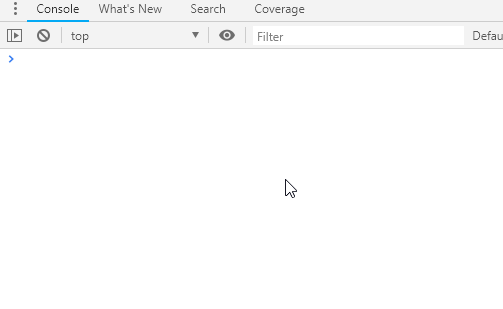

<h1 align="center"></h1>

### easy.log.js
A good log module for browser.More convenient and elegant.


#### Feature
* print every log with a group name, then you can filter logs in `console tab`
* every log has `stack` info, easily for debugging
* you can turn off logging for all groups or specific group

#### Install
Recommended way is by `npm`
```text
npm install --save easy.log.js
```
Also support using by script
```html
<script src="dist/easy.log.js"></script>
```

#### Usage
For webpack project
```text
import LOG from 'easy.log.js'
let log1 = LOG("group-name-1");
log1("log");
log1.log("log");
log1.warn("warn");
log1.error("error");
```

For normal script insert usage, `easy.log.js` export one global variable named `LOG`
```text
let log1 = LOG("group-name-1");
// ...
```

#### Tip
easy.log.js is just for browsers.\
Though easy.log.js can run in nodejs environment, you could not need it.
Try [log4js](https://github.com/log4js-node/log4js-node), it can write logs to file.
 

#### License
MIT
